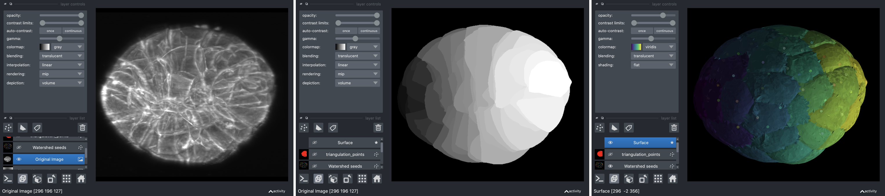
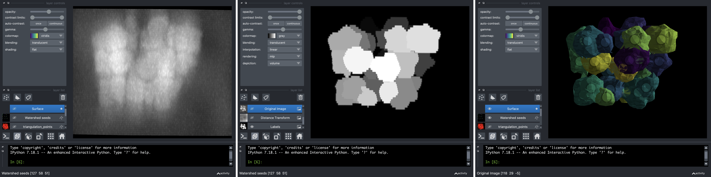

# Delaunay_Watershed

Delaunay-Watershed is an algorithm designed to reconstruct a sparse representation of the geometry of tissues and cell nuclei from instance segmentations, in 2D and in 3D. It accomplishes this by building multimaterial meshes from segmentation masks. These multimaterial meshes are perfectly suited for **storage, geometrical analysis, sharing** and **visualisation of data**. We provide high level APIs to extract geometrical features from the meshes, as well as visualisation tools based on matplotlib (2D) and [polyscope](https://polyscope.run)(3D) and [Napari](https://napari.org) (ND).

Delaunay-Watershed was created by Sacha Ichbiah during his PhD in [Turlier Lab](https://www.turlierlab.com), and is maintained by Sacha Ichbiah, Matthieu Perez and Hervé Turlier. For support, please open an issue.
A preprint of the method will be published soon. If you use our library in your work please cite the paper. The documentation is coming soon on [delaunaywatershed.readthedocs.io.](delaunaywatershed.readthedocs.io.)

Introductory notebooks with precise use case are provided for 2D and 3D libraries. 

## 2D Library
---
The algorithm takes as input segmentation masks and return multimaterial polygonal lines, suited for geometry analysis.
The original raw images can be inserted optionnaly for visualisation but are not used for the reconstruction.

**Geometrical reconstruction of C.Elegans Embryo** (Data from [cShaper](cao13jf.github.io/cshaperpage/))

**Geometrical reconstruction of Cell Nuclei** (Data from [dsb2018](https://www.kaggle.com/c/data-science-bowl-2018))

## 3D Library
---
The algorithm takes as input segmentation masks and return multimaterial triangle meshes, suited for geometry analysis.
The original raw images can be inserted optionnaly for visualisation but are not used for the reconstruction.

**Geometrical reconstruction of P.Mammilata Embryo** (Data from [this paper](https://www.science.org/doi/10.1126/science.aar5663))

**Geometrical reconstruction of Cell Nuclei**  (Data from [Stardist](https://github.com/stardist/stardist))

